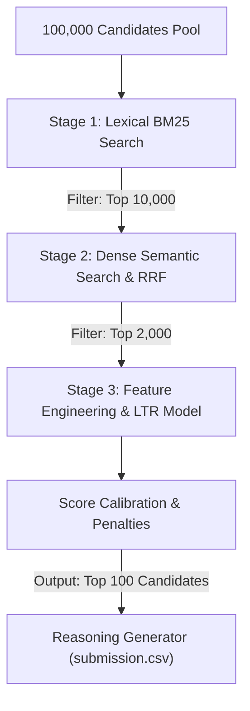

# System Architecture (EDHC)

The **Evidence-Based Digital Hiring Committee (EDHC)** ranking system processes candidate profiles through a multi-stage funnel called the **Three-Stage Sieve**. This design achieves high recall, precise ranking, robust profile validation, and fast execution within strict CPU and memory constraints.

---

## 1. Funnel Stages

### Stage 1: Lexical Pre-Filter (BM25)
- **Objective**: Filter the massive 100,000 pool down to a manageable subset of candidate profiles.
- **Process**: Builds a BM25 index on compiled text representations of candidate profiles (headlines, summaries, education history, skills, and career descriptions). 
- **Scale & Performance**: Surfaces the **Top 10,000 candidates** in under 1 second on CPU.

### Stage 2: Dense Semantic Retrieval & Rank Fusion (RRF)
- **Objective**: Supplement keyword matches with dense semantic similarity to prevent keyword-stuffing traps and retrieve candidates with contextually relevant backgrounds.
- **Process**: Computes dense vector embeddings on-the-fly using the configured encoder (e.g. `all-MiniLM-L6-v2` with E5 prefixes). If neural library loading fails, it dynamically fallback to a deterministic MD5 hash-seeded generator. 
- **Rank Merging**: The lexical ranking ($r_{BM25}$) and dense semantic ranking ($r_{dense}$) are merged for the top 10,000 subset using Reciprocal Rank Fusion (RRF, $k=60$):
  $$RRF\_Score(c) = \frac{1}{60 + r_{BM25}(c)} + \frac{1}{60 + r_{dense}(c)}$$
- **Scale & Performance**: Selects the **Top 2,000 candidates** from RRF scores.

### Stage 3: Feature Generation & Learning-to-Rank (LambdaMART)
- **Objective**: Compute complex business rules, career trajectories, stability, notice periods, and quantitative achievements, feeding them to a specialized machine learning ranker.
- **Process**:
  1. **Feature Extraction**: Computes **39 numerical features** spanning 8 categories (retrieval, semantic, career, skills, behavioral, credibility, impact, and original legacy features).
  2. **LambdaMART Model**: Runs local inference on the feature matrix using a LightGBM ranker (`lambdamart_model.pkl`) trained offline on list-wise query subsets.
  3. **Score Calibration**: Normalizes raw predictions, applies soft business rule penalties (long notice period, consulting backgrounds, and timeline warning warnings), clamps values to $[0.0, 1.0]$, and sorts by calibrated score descending and candidate ID ascending.
  4. **Deterministic Tie-Breaking**: Applies a tiny monotonic decreasing step offset ($i \times 0.0001$) to ensure unique, non-overlapping calibrated scores in the final formatted output.
  5. **Justification Summaries**: The `ReasoningGenerator` parses the final top 100 candidates to create objective summaries detailing titles, merged experience tenures, verified skills, and notice periods.
